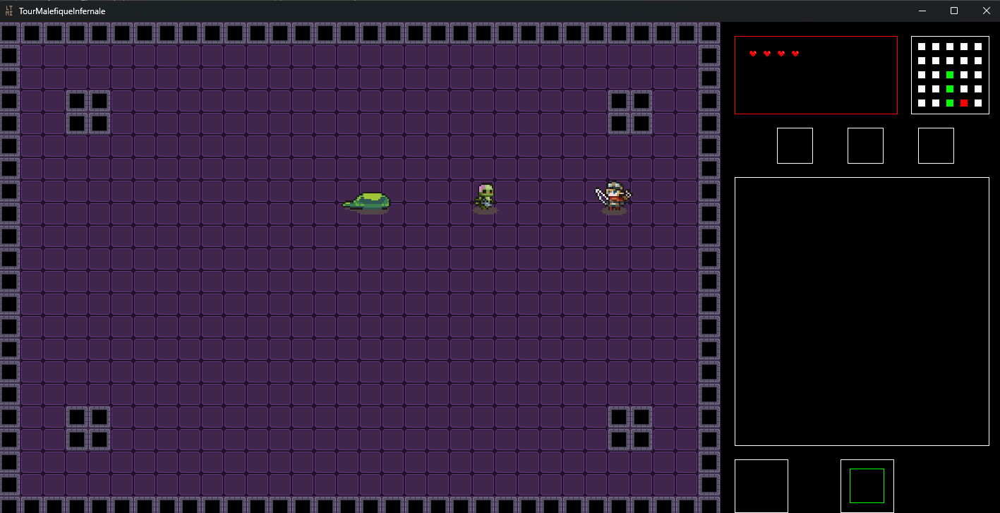
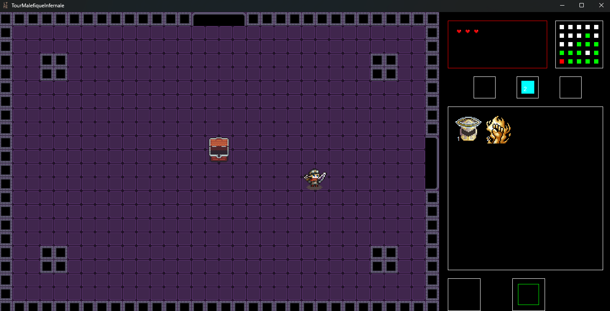

## La tour maléfique infernale
La tour maléfique infernale est un jeu vidéo mené en groupe de 4 réalisé dans le cadre d'un projet évalué. L'objectif était simplement de créer un jeu vidéo. Notre création est donc un jeu de type "RogueLike". Il propose un style de jeu simple : Apparition simple, monstres, clés, étages et boss final. 

<!-- Image 1 centrée -->

   
  <em>Choix du personnage</em>

<!-- Images 2 à 5 : 2 par 2 -->

  <table align="center">
    <tr align="center">
      <td align="center">
         
        <em>Combat de monstre</em>
      </td>
      <td align="center">
         
        <em>Coffre ouvert après avoir battu les monstres</em>
      </td>
    </tr>
    <tr>
      <td align="center">
         
        <em>Sortie du dongeon</em>
      </td>
      <td align="center">
         
        <em>Boss final</em>
      </td>
    </tr>
  </table>

Ce travail a été réalisé avec la méthode agile (cadre SCRUM). Pour la conception du jeu, un [cahier des charges](https://docs.google.com/document/d/1zSflqUJoOf7Ham5kGEMiK747c1gzN_cbQQUpa1HrMTg/edit?tab=t.0#heading=h.ifqz8q80v020) a été élaboré et plusieurs livrables ont été livré lors des différentes itérations.

**Langages et programmation :**
- C++
- Programmation orientée objet

**Outils, environnements et gestion de projet :**
- Git
- QTCreator
- Teams + Miro

**[Retour](../index.md)** 